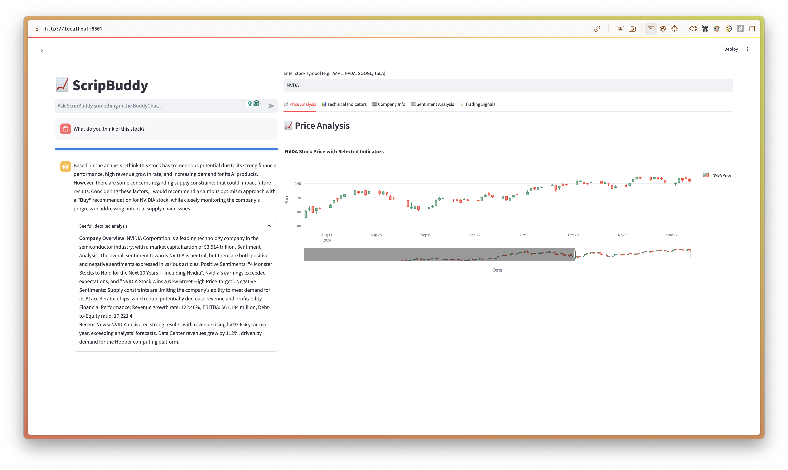
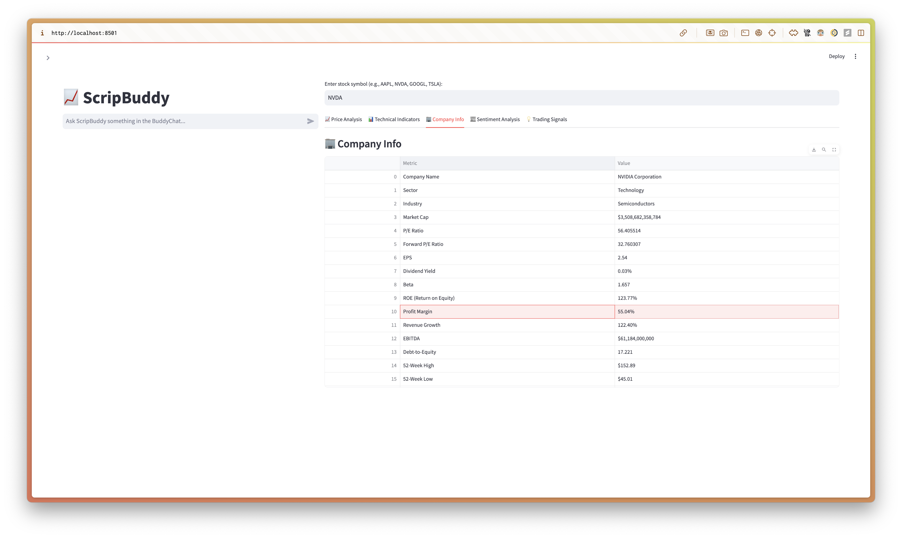
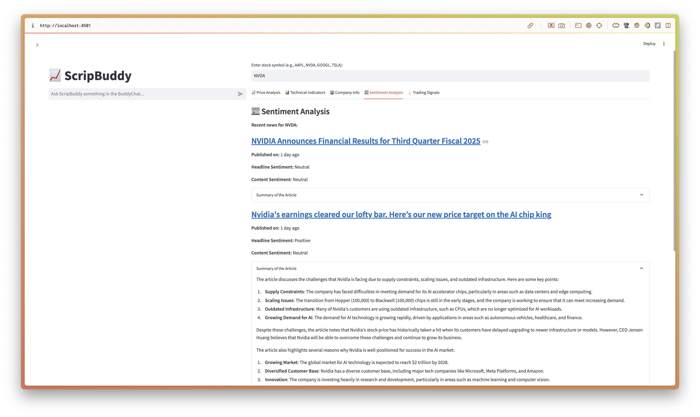

# 📈 ScripBuddy

ScripBuddy is a sophisticated stock analysis and trading assistance platform meticulously designed to provide investors with advanced insights and facilitate informed decision-making. By integrating a variety of analytical tools and state-of-the-art machine learning models, ScripBuddy offers real-time stock analysis, technical indicators, sentiment evaluations, and trading signals.

## ✨ Key Features
1. **Interactive Chat Interface**:
   - Engage with an AI-driven assistant capable of providing real-time analysis, stock data, and responses to complex inquiries.
   - Tailors responses to meet user requirements, offering both concise insights and detailed explanations as appropriate.

2. **Dashboard Components**:
   - **Price Analysis**: Presents interactive candlestick charts, enabling comprehensive visualization of stock price movements over time.
   - **Technical Indicators**: Displays technical indicators, including Moving Averages (MA), Relative Strength Index (RSI), Moving Average Convergence Divergence (MACD), and Bollinger Bands, to facilitate an in-depth assessment of stock trends.
   - **Company Info**: Delivers key company metrics such as market capitalization, sector classification, price-to-earnings (P/E) ratio, dividend yield, and more, providing a fundamental overview.
   - **Sentiment Analysis**: Aggregates and analyzes recent news articles to assess market sentiment, aiding in understanding the broader market perception.
   - **Trading Signals**: Generates actionable trading signals, such as 'Buy' or 'Sell', based on in-depth technical analysis.

3. **Real-Time Sentiment Analysis**:
   - Employs advanced natural language processing techniques to evaluate recent news articles related to a specific company.
   - Categorizes sentiment as Positive, Neutral, or Negative to support users in understanding prevailing market perspectives.

4. **Model Integration**:
   - **Ollama LLM**: Utilized as the primary model for understanding user queries, generating actionable insights, and providing targeted recommendations.
   - **HuggingFace Model**: An alternative deep learning model that offers comprehensive, detailed analysis based on user queries.
   - **Custom Signal Generation**: Leverages key technical indicators, such as MACD, Bollinger Bands, and RSI, to produce actionable trading recommendations.

## 📚 Lessons Learned
- **Natural Language Processing (NLP) Integration**: Effectively integrated NLP models to interpret user queries and provide meaningful stock analyses, enhancing user experience.
- **Data Visualization with Plotly**: Developed sophisticated visualizations to facilitate a deeper understanding of stock patterns and technical indicators.
- **Sentiment Analysis**: Implemented sentiment analysis on corporate news articles, thereby enabling a nuanced view of market sentiment and its potential impacts.
- **Building Interactive Web Apps with Streamlit**: Created an intuitive dashboard interface to enhance the user interaction experience, promoting ease of navigation.
- **Custom Trading Signal Generation**: Developed trading strategies based on multiple technical indicators, facilitating automated and accurate signal generation for market actions.

## 🛠️ Models and Their Purpose
- **Ollama LLM**: Deployed to comprehend and respond to user inquiries regarding stock data, derive insights, and provide strategic suggestions.
- **HuggingFace LLM**: Functions as an auxiliary model, allowing for deeper exploration of stock data and furnishing comprehensive analysis.
- **TextBlob**: Applied for sentiment classification of news articles, determining the sentiment as Positive, Neutral, or Negative based on content analysis.
- **Custom Signal Algorithms**: Implemented to generate automated buy and sell signals by evaluating various technical indicators such as Moving Averages, MACD, and RSI.

## ⛓️ Analysis Flow Overview
The following diagram delineates the structural framework of ScripBuddy, highlighting data dependencies, concurrency, data flow, and interrelationships among components:

The analytical process initiates with the user submitting a stock-related query, which undergoes processing through natural language understanding modules. The Query Dispatcher subsequently triggers concurrent data retrieval processes, encompassing stock data, recent news articles, and additional user-specific inputs. This data is processed in parallel to cleanse and structure the raw information effectively. Multiple branches of analysis—including technical, fundamental, and sentiment analysis—proceed concurrently, followed by the aggregation of custom-generated signals. Ultimately, the synthesized results are visualized and presented to the user through an intuitive interface. This intricate framework underscores the concurrent and parallel nature of the analytic processes, ensuring efficiency, accuracy, and robustness in delivering comprehensive stock insights and recommendations.

## 📸 Dashboard Screenshots
Below are screenshots illustrating the various dashboard tabs, providing a comprehensive overview of the functionalities available:

1. **Interactive Chat Interface**:
   

2. **Company Info**:
   

3. **Price Analysis**:
   

4. **Sentiment Analysis**:
   

5. **Technical Indicators**:
   

6. **Trading Signals**:
   

## ⚠️ Disclaimer
ScripBuddy is intended solely for informational and educational purposes and does not constitute financial, investment, or trading advice. The insights, analyses, and recommendations provided are based on machine learning models and historical data, which are inherently subject to inaccuracies and limitations. Investors are advised to conduct their own independent research and consult with a licensed financial advisor before making any investment decisions. ScripBuddy and its developers shall not be held liable for any financial losses or damages incurred as a result of reliance on the information provided by this platform. Trading in financial markets carries inherent risks, and past performance is not indicative of future results.
